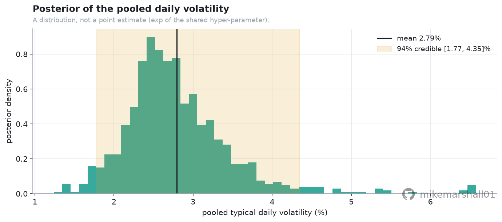
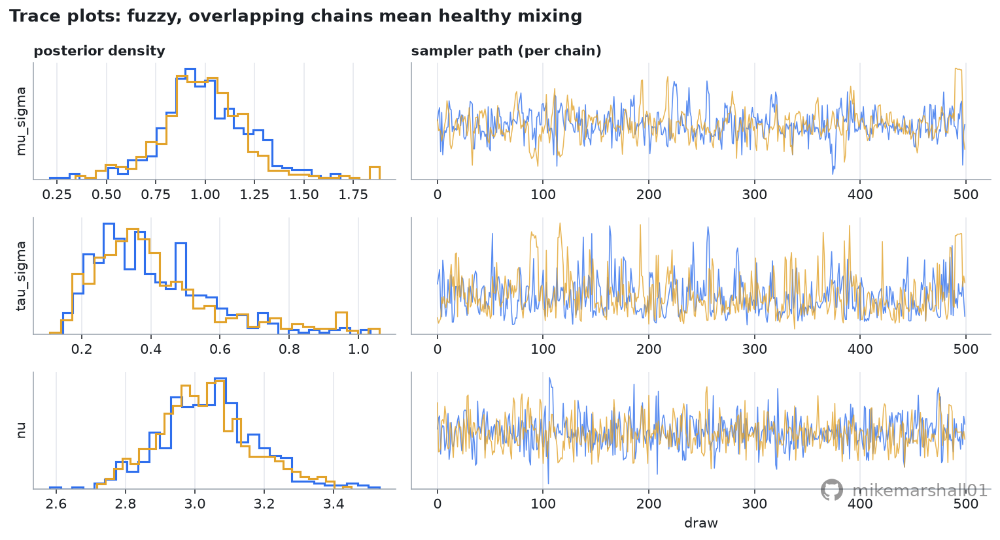
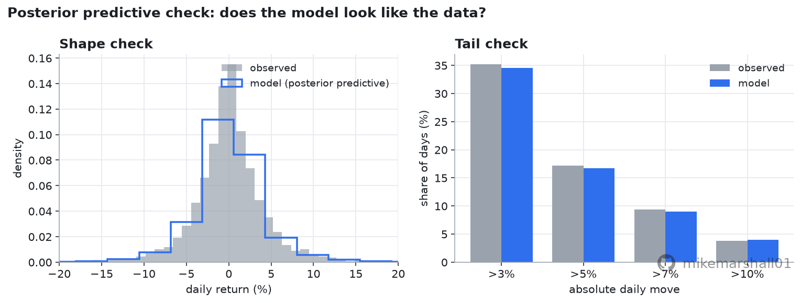
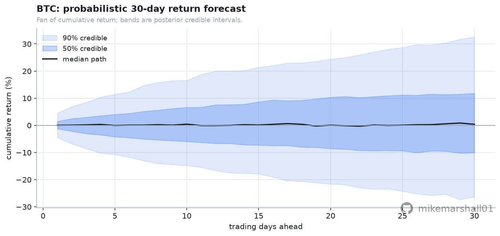
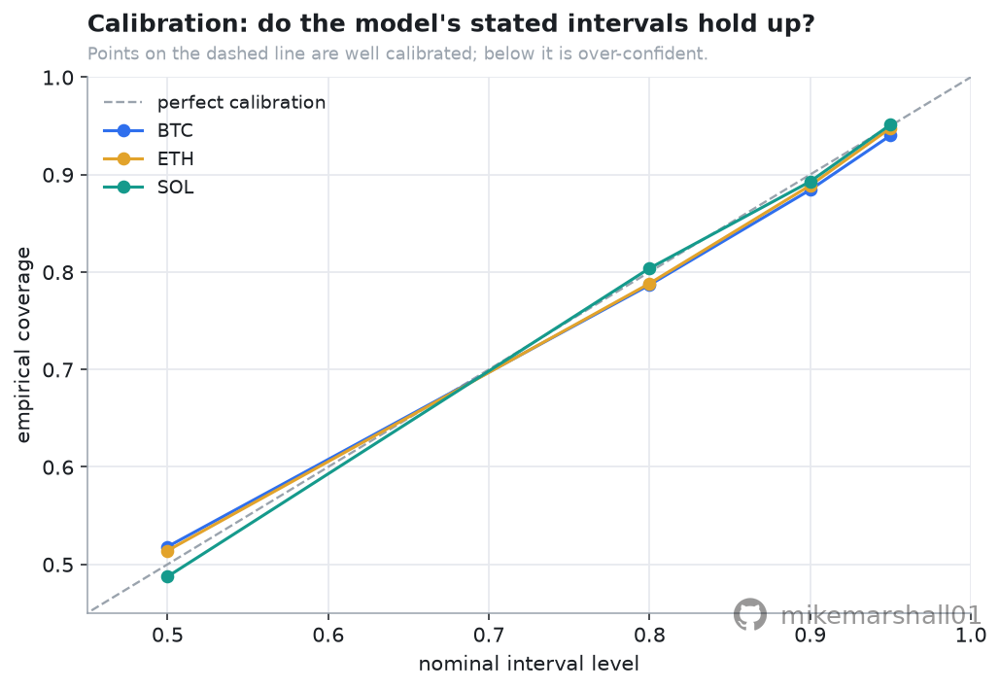

# Bayesian Forecasting for Finance

A hands-on, **free-data** walkthrough of Bayesian inference for markets: stop forecasting a
single number and start forecasting a *distribution*. Fit a small hierarchical model of
daily crypto returns, sample it with modern MCMC, check that it actually fits, and turn it
into a probabilistic forecast with honest credible intervals. Written to be read as much as
run.

Built on free Binance daily data with **no API key required**. Part of a wider crypto-quant
handbook; this is the Bayesian repo.

## About

This notebook began as my own notes while I taught myself Bayesian inference for markets,
forecasting a distribution rather than a single number with hierarchical models in PyMC. I
have tidied and organised it and put it online freely, in the hope that it is useful to
others working through the same concepts. The emphasis is on explaining the ideas clearly,
on free and public data. This is educational and illustrative work rather than production
code or formal research, and any figures are there to illustrate the method rather than to
report results. It is freely available under the MIT licence. Feedback and corrections are
welcome. Provided as is, for educational use, with no warranty.

---

## What you will learn

| Concept | What it is | Where |
|---|---|---|
| **Prior, likelihood, posterior** | the three objects of Bayesian inference, and why the output is a distribution not a point | §1 |
| **Student-t innovations** | fat tails the data can choose, instead of a normal that is fooled by crashes | §2 |
| **Hierarchical / partial pooling** | give each asset its own volatility, but let those volatilities share a family so sparse assets borrow strength | §3 |
| **NUTS / HMC sampling** | how PyMC draws from a posterior you cannot write down, and how to read R-hat and ESS | §4 |
| **Posterior predictive checks** | does the fitted model generate data that looks like reality, especially in the tails? | §5 |
| **Credible intervals and fan charts** | a forecast as a widening fan of plausible paths, folding in both kinds of uncertainty | §6 |
| **Calibration and point-in-time discipline** | are the stated probabilities honest, and how look-ahead bias quietly breaks them | §7 |

Every one of these is reused across the rest of the handbook.

## Example output

The notebook fits three liquid majors (BTC, ETH, SOL) on free Binance daily data since 2021.
A typical run estimates a **pooled typical daily volatility of around 3%** (with a full
posterior, not a point; the exact figure is printed by the run), reproduces the fat tails
of real returns in its posterior predictive check, and produces a 30-day return fan chart
whose 90% credible band is deliberately, honestly wide.

| | |
|---|---|
|  |  |
|  |  |



> The example deliberately reports a **modest, in-sample, deliberately tiny-sample** result
> rather than a flattering one. The notebook is explicit about why, and about the
> walk-forward, point-in-time evaluation that would make it rigorous.

## Data

- **Source:** Binance public `klines` endpoint (`/api/v3/klines`): free, keyless, daily
  history back to 2017 for the majors.
- **How much you need:** a Bayesian return model needs only aligned **close-price series**,
  which are tiny and plentiful. We turn them into daily log returns.
- The fetcher paginates full history and **caches to `data/` as Parquet**, so re-runs are
  instant and work offline after the first fetch.

## Run it

```bash
git clone <this-repo> && cd bayesian-forecasting
python3 -m venv .venv && source .venv/bin/activate
pip install -r requirements.txt

# If `python -m venv` reports "ensurepip is not available" (some minimal Ubuntu/WSL setups),
# either install the venv package once:   sudo apt install -y python3-venv python3-pip
# or bootstrap pip into the venv:          curl -sS https://bootstrap.pypa.io/get-pip.py | .venv/bin/python

# No API key needed for this repo. (Others in the handbook use .env; copy .env.example if so.)

# PyMC compiles to fast C by default. If you do not have the Python dev headers (Python.h),
# the notebook automatically falls back to PyTensor's pure-Python backend (slower but it
# just works). To get the fast path: sudo apt install -y python3-dev g++

# Option A: open the notebook
jupyter notebook notebooks/01_bayesian_forecasting.ipynb

# Option B: re-run headless from the .py source (jupytext keeps the .py and .ipynb in sync)
jupytext --to notebook notebooks/01_bayesian_forecasting.py
jupyter nbconvert --to notebook --execute --inplace notebooks/01_bayesian_forecasting.ipynb
```

## Structure

```
bayesian-forecasting/
├── notebooks/
│   └── 01_bayesian_forecasting.ipynb   # the walkthrough (executed, charts inline)
│   └── 01_bayesian_forecasting.py      # same notebook as a readable .py (jupytext)
├── src/
│   ├── data.py     # free Binance klines fetcher + Parquet cache (keyless)
│   └── style.py    # shared house chart style (consistent look across the handbook)
├── assets/         # rendered charts (committed, so they show in this README)
├── data/           # cached Parquet (gitignored, re-fetched on first run)
├── requirements.txt
└── .env.example
```

## Caveats

This is an **educational** example, not investment advice and not a production model. The
notebook is explicit about its limits: the per-asset volatility is treated as constant (no
*volatility clustering*, which the posterior predictive check shows is the main thing the
small model misses); the calibration check is in-sample, so the model is partly graded on
its own homework; the fan chart is fitted on the whole history rather than point-in-time;
and the sampler is run deliberately small (500 draws, 2 chains) for speed rather than
precision. Each of those is a place where a real workflow would do more, and the notebook
points to the walk-forward, properly-scored evaluation that would convince a sceptic.

## Licence

MIT.
